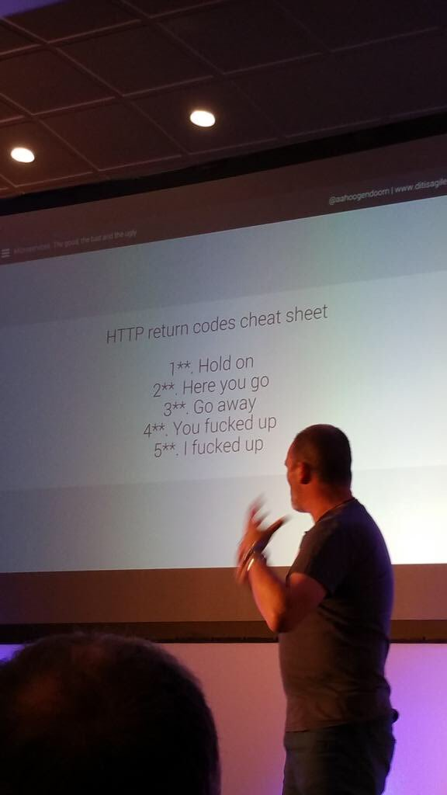
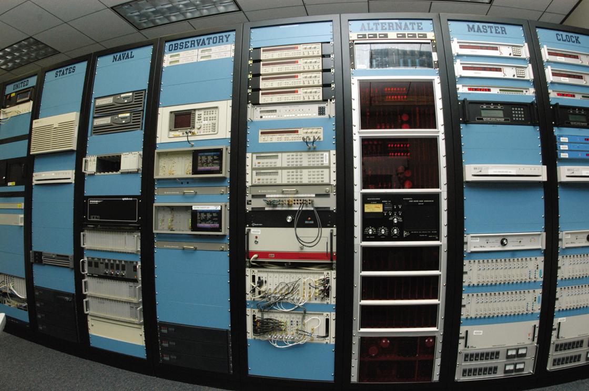

Application Layer
=================

Client-Server Architecture
--------------------------

Links :

.. todo::
	Name these links

1. https://www.youtube.com/watch?v=SwLdKeC8scE
2. https://www.youtube.com/watch?v=L5BlpPU_muY

Some things to note :

* Client initiates the connection
* Server is always waiting for clients
* Server responds to Client’s requests
* This is called the Request-Response cycle

###############################################################################

Basics of Network Addressing
----------------------------

IP Address - is a 32 bit number used to uniquely identify a host system(computer).

Port - is a number that uniquely identifies a process on a host.

Together, a given IP and Port uniquely identify a application running on a host in a
network.

We will discuss IP Addresses and Ports in greater detail when we get to Network
Layer and Transport Layer. 

Socket
^^^^^^

The application layer work is done by the code in the application.

The transport layer work is done by services running on the Operating System.

Socket is a software entity that acts as the interface between Application and the Operating System. Therefore, Socket is like a doorway between Application and Operating System - passing packets from Application to OS and vice-versa.

Equivalently, we can call Socket as the interface between Application Layer and Transport Layer.

Relation between Sockets and Ports
^^^^^^^^^^^^^^^^^^^^^^^^^^^^^^^^^^

Ports and Sockets are very closely related.

Ports are used to uniquely identify a process.

A Socket is the software interface between Application Layer and Transport Layer. An application layer process interacts with the transport layer processes using a socket. During the creation of this socket, a port must be specified, so that the application can be uniquely identified later.

For all intents and purposes, you can consider Ports and Sockets to be equivalent. 

###############################################################################

Transport Layer Protocols available to Applications
---------------------------------------------------

The two most popular Transport Layer protocols available to applications are,

1. TCP - Transmission Control Protocol
2. UDP - User Datagram Protocol

The application developer is free to choose whichever protocol he wants. 

His choice will depend on the differences between the services that TCP and
UDP offer. We will look at this in detail in Transport Layer.

###############################################################################

HTTP
----

HTTP - Hyper Text Transfer Protocol

HTTP began with the Tim Berners-Lee and World Wide Web.

HTTP is stateless

Google, Youtube, Facebook - are all Webpages which are served through HTTP.

Links
^^^^^

.. todo::
	Name these links

1. https://www.youtube.com/watch?v=SzSXHv8RKdM
2. https://www.youtube.com/watch?v=po3zYOe00O4
3. https://www.youtube.com/watch?v=fOikWrpPHp0
4. https://en.wikipedia.org/wiki/Hypertext_Transfer_Protocol
5. https://medium.com/@hanilim/http-codes-as-valentines-day-comics-8c03c805faa0 - HTTP response codes as Valentine’s Day comics

Key Points
^^^^^^^^^^

1. Works using Client - Server model
2. Thus, works through Request - Response cycles
3. Based on TCP/IP
4. Default server port - TCP Port 80 (Don’t have to memorise)
5. Stateless - Server does not maintain client’s history.
6. Request Methods and Response/Status Codes

	* Request Methods define the action that the client wants to perform. Eg : GET, POST, HEAD etc.
	* Status code is a short 3-digit code which tells the result of the request. Eg : 200 - OK, 404 - Not Found, 403 - Forbidden, 407 - Proxy Authentication Required.

Side Joke
^^^^^^^^^

###############################################################################

Cookies
-------

HTTP is stateless. 

The server forgets about the client after each request-response cycle. When the client sends another request, the server does not know about the previous request-response.

So... http servers are a bit like `10 second Tom <https://www.youtube.com/watch?v=6kbY9rGTgQo>`_.

Then how does google and facebook “remember” that we are logged in?

The answer is cookies.

Links
^^^^^

1. https://www.youtube.com/watch?v=I01XMRo2ESg - Really Good
2. https://www.youtube.com/watch?v=64veb6tKTm0 - Layman Explanation

Key Points
^^^^^^^^^^

Cookies are identifiers that are given by web-servers when you visit them for the first time. On subsequent visits to the same website, your browser sends the cookies along with the http request. This allows the website to recollect who you are, what did you do last time etc.

Cookies is what allows for Stateful HTTP.

You can disable cookies in your browser. This increases your security, but you will have to login into gmail and facebook every single time you open them.

.. todo::
	Decide about the "Nitpicks"

.. Nitpicks
.. ^^^^^^^^

.. Cookies can be of two types:

.. 1. Pure Client Side Cookies
   
   Here, all the info that server needs about user, is stored on the cookie itself and sent to the user.

.. 2. Cookies + Server Side Sessions
   
   Here, cookies are just unique identifiers, and the actual info about user is stored on the server. The server looks up this info using the cookie aka. unique identifier.

###############################################################################

Web-Cache/Proxy-Server
----------------------

Links :

.. todo::
	Name these links

1. https://www.youtube.com/watch?v=o2KMk_TyC8E - Must See
2. https://www.youtube.com/watch?v=qU0PVSJCKcs - Must See

###############################################################################

HTTPS
-----

HTTP - sends data as plain text

Not a good way to send stuff like Passwords, Credit Card Info etc.

.. todo::
	Name these links

Link - http://robertheaton.com/2014/03/27/how-does-https-actually-work/

Above link is not a short and sweet video like others. That’s because videos do not contain detailed information. At least, not the ones under 10 minutes. So, it’s usually better to read up content from books, webpages, blogs, wikipedia pages, man pages of commands etc.

###############################################################################

SSH
---

.. todo::
	Expand SSH

.. todo::
	Name these links

Link - https://www.youtube.com/watch?v=mF6J-VQHPxA

The thing is, SSH is extremely useful, but most people don't need the "inner workings" of it.

To work with SSH practically, you need a SSH server and a SSH client.

Most Linux distros come with ssh command line client. You can test this on terminal by typing "which ssh".
For windows, you have Putty - but I do not recommend this, as working with SSH keys is a pain on Putty.

For the server, goto some popular cloud provider, 
be it Digitalocean, GCP, AWS or Azure, and get a Virtual Machine.
Most providers provide a "free-tier". Set up SSH.

Search and Learn :

1. Login
2. Setup SSH Keys
3. Disable Password Based Authentication
4. Use SCP or RSYNC to transfer files

About RSYNC
^^^^^^^^^^^

rsync is an alternative to scp, and has some really cool options.

1. Copy only files that have changed.
2. Copy, but preserve stuff like modification times, owners, permissions etc.
3. Seamlessly compress and decompress files during the copy, to reduce network usage.
4. Delete files in destination, that are not present in source.

.. note::
	I use rsync to backup files from laptop to hard-disk, even though that does not use the network, because of the above features.

###############################################################################

DNS
---

DNS is probably the most important protocol for hoomans to use internet.

The below links explains DNS in a very layman way, without digging deep into how each query happens.

Note that they might be using slightly simplified terminology to make the explanation shorter.

Links

.. todo::
	Name these links

1. https://www.youtube.com/watch?v=Rck3BALhI5c
2. https://www.youtube.com/watch?v=72snZctFFtA

If you want to dig in into the depth of DNS, read the book :D

Key Points
^^^^^^^^^^

Unless you are the network administrator for a large organization(like our college), you don’t need to bother with the inner workings of DNS too much. 

What you need to bother with are,

* DNS is a application level protocol. It uses UDP for its transport layer functionality.

* Computers need IP addresses to find things on internet. Humans like to use names. DNS is the complex system that translates names to addresses. 

   If DNS wasn’t `envisioned <https://en.wikipedia.org/wiki/Paul_Mockapetris>`_, we would all be maintaining a small notebook, much like the phone directory of the landline days. 

* DNS is distributed - the translation table is not stored at a single location.

* DNS is a hierarchical protocol.

   * For example, when I want to go to google.com, my browser asks IITG’s DNS server 202.141.81.2. 
   * If the server has the IP for google.com in its cache, it will give it to me.
   * But if it does not, it will ask a higher level DNS server for the IP.
   * This process can repeat until we reach the Root DNS servers, and finally find the IP.

* DNS replies are cached.
   
   * The first time you load google.com, you possibly started a domino chain of requests up to the internet’s root dns servers.
   * Imagine the same thing happening on every refresh - the root dns servers will not be able to handle the number of requests from the billions of devices connected to the internet.
   * To reduce load on higher level servers, and to reduce network load in general, DNS replies are cached. This means that everyone in the domino chain stores the ip of google.com for a while, including your browser.

* Domain Names are purchased through registrars. Read more at,

	* `Beginners Guide to Domain Names <https://www.icann.org/en/system/files/files/domain-names-beginners-guide-06dec10-en.pdf>`_
	* `Beginners Guides to various activities of ICANN and IANA <https://www.icann.org/resources/pages/beginners-guides-2012-03-06-en>`_
	* `Main website of ICANN <https://www.icann.org/>`_

If you are interested in the inner workings, you can find more detailed information in,

* Kurose and Ross - Section 2.5
* Wikipedia Page of DNS

###############################################################################

NTP
---

NTP is not a very popular protocol, and most courses on networks wouldn’t bother with it. But I think that it deserves at least one slide, considering we have talked so much about DNS.

Key Points

1. NTP (Network Time Protocol) is what allows time to be synced across the world.
2. Like DNS, NTP is also hierarchical.

	* The root time servers (called Stratum 0 servers) are the Atomic Clocks that use Caesium for measuring time - as defined in the SI unit of second. Isn't that cool?

   
   A Stratum 0 NTP server of US Naval Observatory, located in Colorado. Read more `here <https://en.wikipedia.org/wiki/File:Usno-amc.jpg>`_

Read more at,

1. `Wikipedia Page of NTP <https://en.wikipedia.org/wiki/Network_Time_Protocol>`_
2. `NTP Project Page <http://www.ntp.org/ntpfaq/NTP-s-def.htm>`_

.. todo::
	Name these links

.. note::
	Want to implement your own Stratum 0 NTP server with Raspberry Pi?

	http://rdlazaro.info/compu-Raspberry_Pi-RPi-stratum0.html

###############################################################################

DHCP
----

.. todo::
	Expand DHCP

Most of us never set Static IP Addresses. We connect to a wifi network, and everything just works. 

All thanks to DHCP - Dynamic Host Configuration Protocol.

Unless you are going to be setting up your own DHCP server - you only need a rudimentary understanding of DHCP.

We have decided to take a leaf from the book of mathematicians and leave DHCP as an exercise to the reader.

Search online, find some content, and learn yourself.
