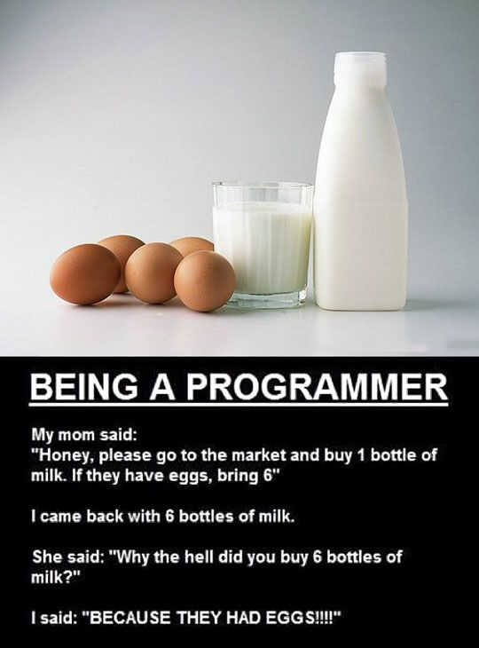

Introduction
============

How to use this course?
-----------------------

Excerpt from Arch Wiki, 

	*Most articles on the ArchWiki do not attempt
	to provide a holistic introduction to a single topic;
	they are instead written in adherence to the DRY principle,
	under the assumption that the user will seek out
	and read any supporting material that they do not yet understand.*

The philosophy of this microcourse is quite similar.
This microcourse mostly points to good resources,
as there is already sufficient content on the internet.
You'll find a curated list of blogs, videos and notes inside.

One way to gain knowledge is to read facts and statements. Another way
is to question the facts and statements, and search for answers. This 
"Pursuit of Answers" often leads to deeper understanding of the subject.

Thus, there is additional narrative that asks questions, and tries to
answer them. The readers are encouraged to ask more questions.

.. note::
	Check out -
	"Kurose and Ross - Computer Networking, A Top-Down Approach".

.. note::
	Wikipedia is good for in-depth info. The only thing probably better 
	than the Wikipedia pages are the RFCs themselves.

########################################################################

The Internet Network Stack
--------------------------

The TCP/IP stack divides network protocols and concepts into 5
*conceptual* layers.

1. Application Layer
2. Transport Layer
3. Network Layer
4. Link Layer
5. Physical Layer

Why did they do this?
^^^^^^^^^^^^^^^^^^^^^

To understand that, we have to ask ourselves, "What is required/expected
of 'computer networks'?"

* The networks should allow for **communication** between computers
* We expect the networks to be **reliable**, **error-free**, **fast**
  and **easy-to-use**. What's the point of a new technology,
  if it's no better than existing ones like radio, telegraph etc.

The terms in bold above, are vague, and thus, the problem is of a
**very broad scope**.

To give an idea of how broad, here is a list of sub-problems that all
fall in the above umbrella. 

* How can we send data from one computer to another, without errors?
* Computers understand numbers, and thus, *addresses* are stored as
  numbers. But humans are not good at remembering long numbers, so how
  can we build a *translator* between names to numbers?
* How can we build an application that allows video-conferencing? 

Humans are not meant to think and work on such a broad scope. Thus, we
split the problem into parts and work on the parts independently. That
is why we people have defined logical layers in networking - so that we
can independently work on improving each layer, without having to worry
about others. They are able to do this because the interface between
each of the layers is well-defined. 

########################################################################

What is a "Protocol"?
---------------------

In layman terms, a protocol is a language. Just like English and Hindi.

The difference is that protocols have much lesser ambiguity in their
statements.

Computers cannot work with ambiguous statements - they don’t have the
cognitive capabilities that we do.

Seen this programmer joke?

Some Example Protocols
^^^^^^^^^^^^^^^^^^^^^^

1. HTTP, SSH, DNS, NTP, DHCP - Application Layer Protocols
2. TCP, UDP - Transport Layer Protocols
3. IP, ICMP - Network Layer Protocols
4. ARP, Ethernet - Link Layer Protocols

We will cover each in detail over the course.

########################################################################

Links to Read
-------------

* Basic Video - `Simple 2 min video on network layers`_

* Intermediate Video - `Really cool 20 minute lecture`_

* Super Basic Video - `Techquickie - What is TCP/IP?`_

.. note::
	Above video jumbles up network layer and link layer a little bit
	 - just ignore that.

* Super Basic (and funny) Video - 
  `thenewboston - what is a protocol?`_

.. note::
	If you are feeling like binge-watching something, binge-watch this.
	
	At least you'll learn something.
	
	`thenewboston - Computer Networking Playlist`_

.. _`Simple 2 min video on network layers`:
	https://www.youtube.com/watch?v=zyL1Fud1Z1c

.. _`Really cool 20 minute lecture`:
	https://www.youtube.com/watch?v=Pje0l5r7_lk

.. _`Techquickie - What is TCP/IP?`: 
	https://www.youtube.com/watch?v=PpsEaqJV_A0

.. _`thenewboston - what is a protocol?`:
	https://www.youtube.com/watch?v=VlKks__ZhI0

.. _`thenewboston - Computer Networking Playlist`:
	https://www.youtube.com/playlist?list=
	PL6gx4Cwl9DGBpuvPW0aHa7mKdn_k9SPKO

The first two probably confused you with 5 Layer Internet Stack vs 7
Layer OSI Reference Model. In that case, this might help :

* `OSI - Comparison with TCP/IP (Wikipedia)`_
* `Internet Protocol Suite - Comparison with OSI (Wikipedia)`_

.. _`OSI - Comparison with TCP/IP (Wikipedia)`:
	https://en.wikipedia.org/wiki/OSI_model
	#Comparison_with_TCP.2FIP_model

.. _`Internet Protocol Suite - Comparison with OSI (Wikipedia)`:
	https://en.wikipedia.org/wiki/Internet_protocol_suite
	#Comparison_of_TCP.2FIP_and_OSI_layering

In case that confused you even more, read the next section.
I promise I'll clarify this.

OSI vs Internet
^^^^^^^^^^^^^^^

* The OSI Model was created by International Organization for
  Standardization(ISO).

* The internet as it is today, was developed by several thousand
  (or more) different people. No single person or entity can be credited
  for creating the Internet.

* The people who worked behind it, took the OSI Model as a reference,
  and built Internet’s structure based on same principles. In this
  process, they dropped two layers which they thought were not
  necessary.

* So.. who will perform the jobs of these layers?
  If an application needs the services that these layers provided,
  let the application developer write his own code.

* Throughout this course, we work with 5 layer internet stack.
  So you can forget the OSI Reference Model.
