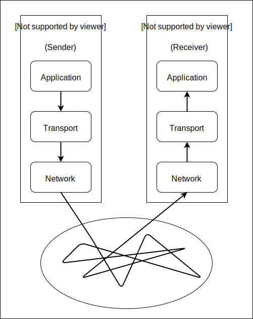
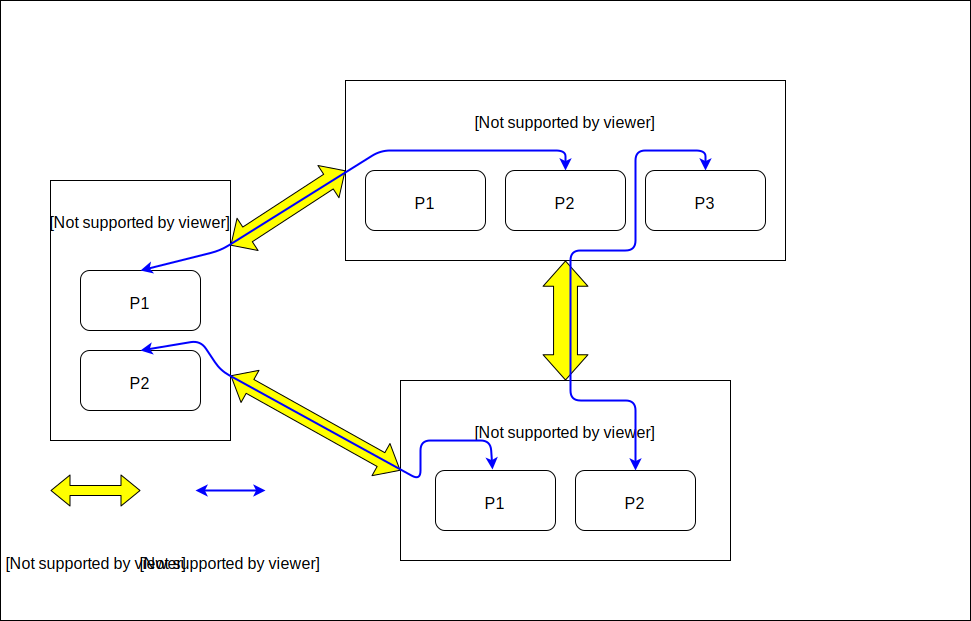
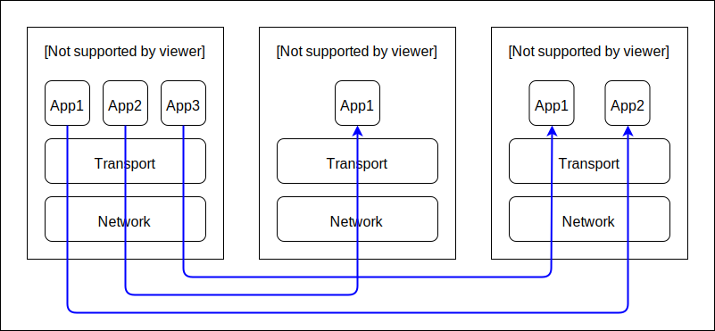

Transport Layer
===============
    
    *We will cover Transport Layer in more
    detail than any other layer.*

Interface between Application Layer and Transport Layer
-------------------------------------------------------

The transport layer provides logical communication between applications.
It *abstracts away* the lower level details from the application.

In other words, to the application processes, it looks as if they are 
communicating directly. While in reality, they might be on opposite
sides of the world.

On the sender, the application sends the data to the transport
layer service, which processes the data, and sends it
down to the network layer service.

The network layer is responsible for sending the packets to the
destination machine.

On the receiving side, the network layer passes the packets to
the transport layer service, which passes it to the appropriate
application.

The two most popular transport layer protocols on the internet stack
are,

1. TCP (Transmission Control Protocol)
2. UDP (User Datagram Protocol)

.. note::

    The above explanation considers just one instance of a "application
    communicating with another application". In reality, networks are
    much more complex.

    To give an idea, each host will have multiple applications using the
    network, sending and receiving data
    from various other applications running on various machines in the network.

.. note::

    The transport layer service and network layer service are almost
    always part of the Operating System.

    Thus, for a host, there is only one transport layer service and one
    network layer service.

########################################################################

Interface between Transport Layer and Network Layer
---------------------------------------------------

Transport Layer provides **logical communication between processes**.
Network Layer provides **logical communication between hosts**.

The distinction is subtle, but it is important.
Read more from Kurose and Ross Section 3.1.1

.. note::

    The image is only for understanding, and does not represent
    any physical connection, such as copper cables or wireless
    signals.
    
    The *physical* connection between the hosts might be very different
    from the *logical* connection that the network layer or transport
    layer sees.

########################################################################

Recap
-----

Transport Layer Protocols have the task(s) of,

* Providing a process-process communication
  using a host-host communication.
* Additionally, choose to provide some other services, such as,

    * Error Detection and Correction
    * Reliable Data Transfer
    * In-Order Arrival
    * Flow and Congestion Control

########################################################################

Multiplexing and Demultiplexing
-------------------------------

Providing process-process communication using host-host
communication is also called Transport Layer Multiplexing and
Demultiplexing.

Let us consider an artificial example to understand this.

Applications on Host A want to send data to some other applications running on
some other hosts in the network. They pass the destination ip address
and ports to the transport layer, along with the data.

The transport layer assigns a random unused source port. It stores both
source and destination port in the header of the packet, and sends the
packets down to network layer (along with destination ip).

The network layer does its job, and sends packets over the network.
The packets finally reach the network layers of respective
destination hosts.

On Host B, the packets reach transport layer. For each packet,
the transport layer has to identify the intended application,
and forward the packet to that application. It does so by looking
at the destination port specified in the header of the packet.

Exactly the same process happens in Host C.

The careful reader would remember that we also stored the "source port"
in the header. This serves as a "from" address. The receiver
can use this to reply back to the sender.

.. note::
    
    We mentioned "applications pass data to transport layer" and
    "transport layer forwards packets to application".

    In the strictest sense, that is not true. Data does not flow
    directly between the two, rather, it flows through "sockets".

    In case of a client application, the app creates a socket,
    and, using the socket, connects to a destination ip and port.
    Then, the application uses the socket to transfer data to the
    transport layer below.
    When the communcication is over, the application closes the socket
    connection.

    Server applications, on the other hand, work slightly differently.
    They bind to a socket,
    and listen on a particular source ip and port.
    When a client wants to connect, the server accepts the connection.
    Then, the transport layer can forward the received data to
    the application via the socket.

########################################################################

UDP
---

UDP is a no-frills protocol. It does the bare minimum that a transport
layer protocol is expected to do.

* Multiplexing multiple processes via single network connection
* Connectionless
* Minimal error checking using a Checksum
* UDP, by itself, is `simplex`_. However, an application can implement a
  `full-duplex`_ service on top of UDP.

In UDP, the application creates a socket, and sends data, or waits for
data to be received.
This is very different from how TCP does things(see below), thus, UDP is
said to be connectionless.

The error checking in UDP is also simple and minimalistic. You can read
more in `wikipedia page of UDP`_.

Why do we even have UDP?
^^^^^^^^^^^^^^^^^^^^^^^^

The major reasons are listed here.
There are also other reasons, which are specific to use cases.
Those are left to reader for self-exploration.

1. Finer Application Level control on what, when and how data is sent. 
   One example is VoIP and online gaming.
   In these applications, it is more important to keep the stream of
   data going *realtime* rather than making sure a particular packet
   reaches (by re-sending it).
   However, TCP is all about reliability and does not provide any
   guarantees on data rate.

2. No three-way handshake. In UDP, there is no *overhead* of the 
   "connection establishment". Thus, it is used in situations where
   connection setup is too costly, like DNS.

.. _`wikipedia page of UDP`:
    https://en.wikipedia.org/wiki/User_Datagram_Protocol

########################################################################

TCP
---

* TCP is connection oriented.

    A TCP Connection is uniquely specified by a pair of sockets 
    identifying its two sides.
    In other words, A TCP connection is uniquely identified by
    the quadruple (Source IP, Source Port, Dest IP, Dest Port).

* TCP is a `full-duplex`_ service.

* TCP connection is Point-to-Point.

* TCP connection is established using a three-way handshake.

    - Client sends a SYN packet.
    - Server replies with a SYN-ACK packet.
    - Client replies with a final ACK packet. This packet can also
      contain additional application data.

* Services provided by TCP

    - Reliable data transfer : Data that is sent will arrive.    
    - In order arrival : Data will arrive in same order as sent.
    - Error free : Error Detection and Correction
      ensures no bits are flipped.
    - Flow control : Ensures that Sender cannot send data faster than
      Receiver can receive.
    - Congestion Control : If network is busy, wait for *sometime*
      before trying to access network again.
      Makes sure network resources are available to everyone.

.. _`simplex`:
    https://en.wikipedia.org/wiki/Simplex_communication

.. _`full-duplex`:
    https://en.wikipedia.org/wiki/Duplex_(telecommunications)#Full_duplex

########################################################################

Principles of Reliable Data Transfer
------------------------------------

Although this topic is interesting, it is theoretical in nature, and will not
be of use to everyone.

* Kurose and Ross Book Section 3.4
* http://www2.ic.uff.br/~michael/kr1999/3-transport/3_040-principles_rdt.htm
* http://www.cs.ccsu.edu/~stan/classes/cs490/slides/networks4-ch3-3.pdf

.. todo::
    * Cleanup TCP
